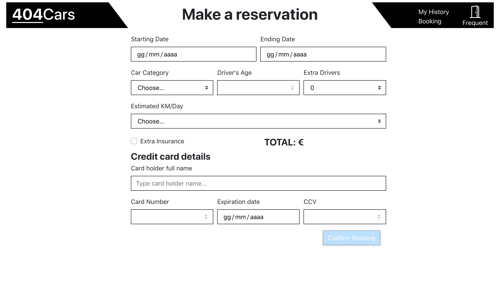

# Exam #277867: "404 Cars"
## Student: s277867 PAPPALARDO MARCO GIULIO 

## React client application routes

- Route `/home`: main page with the list of cars owned by the rental
- Route `/booking`: page containing the form to make a reservation
- Route `/confirmation`: page displaying the result of a booking attempt
- Route `/history`: page displaying the list of booking (paste and future) made by the user
- Route `/about`: information about the author
## REST API server

- POST `/api/login`
  - request body-> email and password of a user
  - response body contains all user info (id,email,name,nbookings)
- GET `/api/cars/?brand=x&category=y`
  - request parameters -> list of brands and categories to be used in quering the DB
  - response body content-> a list of car info (id,brand, category, model, year, fuel)
- GET `/api/allcategories`
  - response body content-> a list of strings (categories) 
- GET `/api/allbrands`
  - response body content->a list of strings (brands) 
- POST `/api/logout`
  - response body content-> request to clear cookie 'token'
- GET `/api/bookings`
  - request jwt cookie  
  - response body content->a list of bookings (start date, end date, category, driver's age, estimated km/day, extra drivers, extra insurance, price, car(id,brand, category, model, year, fuel),userID);
- POST  `/api/bookings`
  - request jwt cookie
  - request body contains all booking info
  - response header code is 200 and empty body if booking is completed
  - response header code is 403 and body is error object if booking info is wrong
  - response header code is 504 and body is error object if DB generate some error
- POST  `/api/price`
  - request jwt cookie
  - request body contains all booking info
  - response header code is 200 and body is price(number)  if booking info is correct and avaiable
  - response header code is 403 and body is error object if booking info is wrong
  - response header code is 504 and body is error object if DB generate some error
- POST  `/api/card`
  - request body contains all credit card info
  - response header code is 200 and body is boolean(true) in  if booking info is good
  - response header code is 200 and body is boolean(false)  if credit card info is missing
- DELETE  `/api/bookings/:bookingid`
  - request params contains a booking id
  - response header code is 200 and body is "id removed" if booking info is good
  - response header code is 504 and body is error object if credit card info is missing
- GET `/api/user`
  - rquest jwt cookie
  - response body content->all user info (id,email,name,nbookings)

## Server database

- Table `users` - contains  id, hash, email ,nbookings ----> storing user info needed for login and booking
- Table `bookings` - contains id,start date, end date, category, extra drivers, extra insurance, driver's age, estimated km/day, price, carId, userId  --> contains all bookings made toghether with id of user and car 

- Table `cars` - contains id,brand, category, fuel type, year, model -----> list of all cars and their infos

## Main React Components

- `MyBody` (in `MyBody.js`): container for all body routes and componets, collects all properties for body
- `MyNavBar`(in `MyNavbar.js`): container for all Navbard routes and componets, collects all properties for NavBar, contains filters for car
- `BookingForm` (in `BookingForm.js`): contains the interactive configuration page to make a reservation
- `LoginForm` (in `LoginForm.js`): modal for login
- `ConfirmationPage` (in `ConfirmationPage.js`): contains a jumbotron with result of booking (a text)
- `Summary` (in `Summary.js`): modal that works as confirmation for canceling a reservation
- `History`(in `History.js`):contains a list of all user reservation with delete button only for future ones dates are in format (mm/dd/yyyy)
- `CarList` (in `CarList.js`): contains a list of all cars owned by the rental

(only _main_ components, minor ones may be skipped)

## Screenshot

## Test users

* marco@email.it, password1 (frequent customer) (the password is literally "password1")
* user@email.it, password2
* john.doe@email.it, password3 
* lorem@email.it, password4
* frequent@email.it, FrequentPassword (frequent customer)